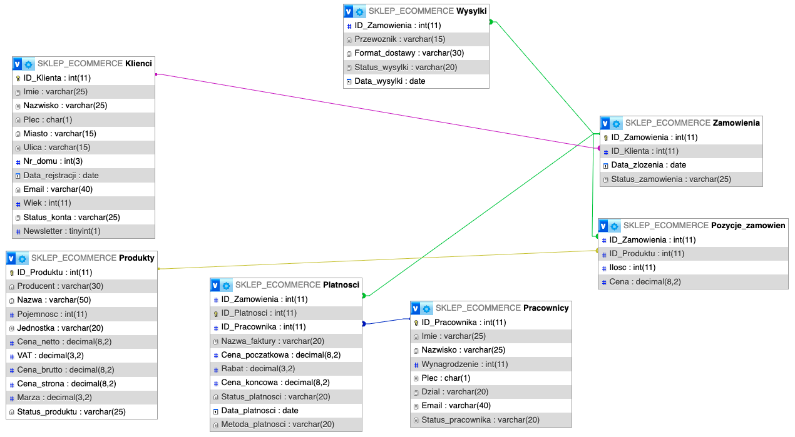

# Sklep E-commerce - Model Bazy Danych


## 📖 Opis projektu
Projekt został **stworzony całkowicie od podstaw** – od pomysłu, przez zaprojektowanie struktury bazy danych, aż po implementację i analizę danych.  

Cały scenariusz został wymyślony przeze mnie, włącznie z:
- zaprojektowałem strukturę bazy danych (ERD) w **MySQL Workbench** oraz **phpMyAdmin**,  
- tworzeniem tabel, relacji, widoków i zapytań w SQL,  
- opracowaniem procesów biznesowych sklepu internetowego,  
- analizą i raportowaniem danych w **Excel** i **Power BI**,  
- wykorzystaniem narzędzi do zarządzania i prezentacji danych,  
- pełnym przygotowaniem dokumentacji technicznej.  

Celem projektu było nie tylko odwzorowanie działania sklepu e-commerce, ale także **nauka i rozwój umiejętności praktycznych** w:
- **SQL** (projektowanie i optymalizacja zapytań),  
- **Excel** (analizy i raportowanie),  
- **Power BI** (wizualizacje i dashboardy),  
- **zarządzaniu projektem IT**,  
- **projektowaniu struktur bazodanowych**.  

Projekt pokazuje moje podejście do **całościowego tworzenia systemu** – od koncepcji po analizę wyników.


## 🧩 Struktura
Baza została zaprojektowana w oparciu o kluczowe procesy e-commerce.  
Składa się z 7 głównych tabel:  

- **Klienci** – dane użytkowników (7 tys. rekordów)  
- **Produkty** – asortyment sklepu (3 tys. rekordów)  
- **Zamówienia** – transakcje klientów (90 tys. rekordów)  
- **Pozycje_zamówień** – szczegóły zamówionych produktów  
- **Płatności** – faktury, statusy i metody płatności  
- **Wysyłki** – przewoźnicy, format dostawy, status przesyłki  
- **Pracownicy** – dane pracowników (100 rekordów)  

Szczegółowy opis wszystkich pól tabel znajduje się w [docs/Struktura.pdf](docs/Struktura.pdf).

**Rys. 1.** Schemat encji i relacji (ERD) bazy sklepu e-commerce.



## 📂 Struktura repozytorium

- **sql/**
  - `SKLEP_ECOMMERCE.SQL` – pełna struktura bazy danych  
  - `KOMENDY.SQL` – przykładowe zapytania SQL  
  - `WIDOKI.SQL` – definicje widoków  

- **csv/**
  - `1Klienci.csv` – dane klientów (7 000 rekordów)  
  - `2Zamówienia.csv` – dane zamówień (90 000 rekordów)  
  - `3Produkty.csv` – dane produktów (3 000 rekordów)  
  - `4Pracownicy.csv` – dane pracowników (100 rekordów)  
  - `5Płatności.csv` – dane płatności (90 000 rekordów)  
  - `6Pozycje_zamówien.csv` – dane pozycji zamówień  
  - `7Wysyłki.csv` – dane wysyłek  

- **docs/**
  - `Schemat_ERD.png` – diagram bazy danych  
  - `Struktura.pdf` – szczegółowy opis tabel i pól  
  - `E-commerce_EXCEL.pdf` – analizy w Excelu  
  - `E-commerce_BI.pdf` – raporty w Power BI
  - `Model.mwb` - model bazy danych w formacie **MySQL Workbench**

- **excel/**
  - `E-commerce_EXCEL.xlsx` – plik źródłowy z analizami  

- **powerbi/**
  - `E-commerce_BI.pbix` – dashboard w Power BI  

- **assets/**
  - `LOGO.jpeg` – logo projektu

## 🚀 Instrukcja uruchomienia

1. **Baza danych**
   - Zaimportuj plik `sql/SKLEP_ECOMMERCE.SQL` do środowiska **MySQL** lub **MariaDB**.  
   - (Opcjonalnie) uruchom `sql/WIDOKI.SQL`, aby utworzyć widoki, oraz zapoznaj się z przykładowymi zapytaniami w `sql/KOMENDY.SQL`.  

2. **Dane źródłowe**
   - Pliki CSV w folderze [`csv/`](csv/) zawierają dane testowe do każdej tabeli.  
   - 📌 Pliki zostały **ponumerowane w kolejności importu** – dzięki temu zachowana jest poprawność relacji między tabelami.  
     - `1Klienci.csv` → tabela *Klienci*  
     - `2Zamówienia.csv` → tabela *Zamówienia*  
     - `3Produkty.csv` → tabela *Produkty*  
     - `4Pracownicy.csv` → tabela *Pracownicy*  
     - `5Płatności.csv` → tabela *Płatności*  
     - `6Pozycje_zamówien.csv` → tabela *Pozycje zamówień*  
     - `7Wysyłki.csv` → tabela *Wysyłki*  

   - Importuj je w tej kolejności, aby uniknąć błędów związanych z kluczami obcymi i powiązaniami między tabelami.  

3. **Analizy i dashboardy**
   - Dashboardy w Excelu i Power BI dostępne są w katalogach [`excel/`](excel/) oraz [`powerbi/`](powerbi/).  
   - Ze względu na rozmiar plików, pełny plik Excel został umieszczony w Google Sheets (szczegóły w [`excel/excel_info/README.md`](excel/excel_info/README.md)).  

## 💻 Przykładowe zapytania SQL

1. **Widok rankingu sprzedaży produktów (wg sprzedaży)**
```
CREATE VIEW Produkty_ranking_sprzedaz AS
SELECT
	RANK() OVER (ORDER BY `Sprzedaz (PLN)` DESC) AS RANKING,
    `Sprzedaz (PLN)`,
    `Ilosc sprzedanych`,
    ID_Produktu,
    Nazwa,
    Producent,
    `Opakowanie`,
    `Cena na stronie`,
    `Marza (%)`,
    `Zarobek`
FROM (
SELECT
	SUM(Pozycje_zamowien.Ilosc) AS 'Ilosc sprzedanych',
    Pozycje_zamowien.ID_Produktu,
    Produkty.Nazwa,
    Produkty.Producent,
    CONCAT(Produkty.Pojemnosc, ' ', Produkty.Jednostka) AS 'Opakowanie',
    Produkty.Cena_strona AS 'Cena na stronie',
    CONCAT(Produkty.Marza * 100, '%') AS 'Marza (%)',
    Produkty.Cena_strona * SUM(Pozycje_zamowien.Ilosc) AS 'Sprzedaz (PLN)',
    Produkty.Cena_strona * SUM(Pozycje_zamowien.Ilosc) * Produkty.Marza AS 'Zarobek'
FROM Pozycje_zamowien
JOIN Produkty ON Pozycje_zamowien.ID_Produktu = Produkty.ID_Produktu
GROUP BY 
    Pozycje_zamowien.ID_Produktu,
    Produkty.Nazwa,
    Produkty.Producent,
    Produkty.Pojemnosc,
    Produkty.Jednostka,
    Produkty.Cena_strona,
    Produkty.Marza
) AS Produkty_Ilosc;
```

2. **Najwyższe i najniższe wynagrodzenie pracownika**
```
(SELECT ID_Pracownika, Imie, Nazwisko, Plec, Dzial, Wynagrodzenie, 'Najw. wynagrodzenie' AS Pozycja FROM Pracownicy WHERE Status_pracownika = 'Zatrudniony' ORDER BY Wynagrodzenie DESC LIMIT 1)
UNION
(SELECT ID_Pracownika, Imie, Nazwisko, Plec, Dzial, Wynagrodzenie, 'Najn. wynagrodzenie' AS Pozycja FROM Pracownicy WHERE Status_pracownika = 'Zatrudniony' ORDER BY Wynagrodzenie ASC LIMIT 1);
```

3. **Liczba wydanych FV przez pracownika + JOIN**
```
SELECT Platnosci.ID_Pracownika, Pracownicy.Imie, Pracownicy.Nazwisko, COUNT(DISTINCT ID_Platnosci) AS "Liczba zamowien" FROM Platnosci JOIN Pracownicy ON Platnosci.ID_Pracownika = Pracownicy.ID_Pracownika GROUP BY Platnosci.ID_Pracownika, Pracownicy.Imie, Pracownicy.Nazwisko ORDER BY COUNT(DISTINCT ID_Platnosci) DESC;
```

## 🎯 Cele projektu
- Rozwój praktycznych umiejętności w SQL, Excel, Power BI i Workbench  
- Zaprojektowanie realistycznej bazy e-commerce od podstaw  
- Analiza dużego zbioru danych (ponad 180 000 rekordów)  
- Budowa portfolio do pokazania na rozmowach rekrutacyjnych
  
## 📐 Dokumentacja w MySQL Workbench

Dodatkowo do repozytorium został dołączony plik modelu bazy danych w formacie **`.mwb`** (MySQL Workbench).  
Dzięki niemu można:

- otworzyć pełny model logiczny i fizyczny bazy,  
- zobaczyć wszystkie relacje i atrybuty,  
- wygenerować diagramy oraz skrypty SQL bezpośrednio z Workbencha.
  
## 🧠 Czego się nauczyłem
- Projektowania i normalizacji baz danych  
- Tworzenia i optymalizacji zapytań SQL  
- Dokumentowania projektu w MySQL Workbench  
- Tworzenia raportów i dashboardów w Excelu i Power BI  
- Pracy z danymi w formacie CSV i integracji z SQL
  
